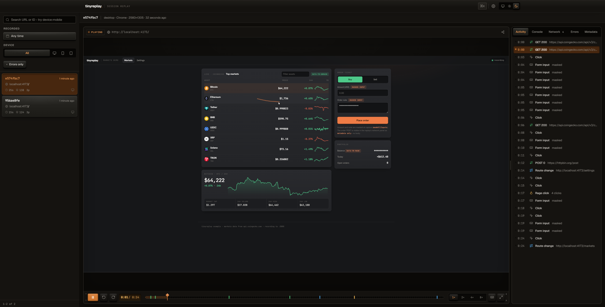

# tinyreplay

tinyreplay is a small, self-hosted session replay tool. It records browser
sessions with a browser SDK, stores replay batches in local SQLite, and shows
them in a local dashboard.

It is for indie developers and small teams that want to inspect what happened in
a browser session without adopting a full analytics platform.

tinyreplay is intentionally minimal. It does not provide funnels, heatmaps,
feature flags, user profiles, accounts, billing, mobile SDKs, hosted storage,
SSO, distributed ingestion, or compliance guarantees.

tinyreplay is pre-1.0. The core local session replay flow works, but APIs,
storage format, configuration, and dashboard behavior may change before v1.
The `v0.1.0` release should be treated as an early self-hosted release.



## Quick Start

From a checkout:

```bash
npm install
npm run build
npm run start
```

Open <http://localhost:3000>.

For development:

```bash
npm install
npm run dev
npm run dev:docs
```

The SDK runs in watch mode, the dashboard runs at <http://localhost:3000>, and
the docs app runs at <http://localhost:3001>.

## Docker

Run the published image (no checkout, no build):

```bash
docker run -p 3000:3000 -v "$(pwd)/data:/app/data" ghcr.io/kzekiue/tinyreplay
```

Open <http://localhost:3000>. Session data persists in `./data/tinyreplay.db` on
the host. The `latest` tag tracks `main`; tagged releases publish a versioned
image (for example `ghcr.io/kzekiue/tinyreplay:0.1.0`).

To build from source instead (for development or local changes):

```bash
docker compose up --build
```

The compose file mounts `./data` to `/app/data`. The equivalent plain Docker
commands:

```bash
docker build -t tinyreplay .
docker run --rm -p 3000:3000 -v "$(pwd)/data:/app/data" tinyreplay
```

Useful endpoints:

| Purpose | URL |
| --- | --- |
| Dashboard | <http://localhost:3000> |
| SDK bundle | <http://localhost:3000/sdk/tinyreplay.umd.js> |
| Ingest API | `POST http://localhost:3000/api/ingest` |
| Health probe | `GET http://localhost:3000/api/health` |

## SDK Setup

Use the bundle served by your tinyreplay server:

```html
<script src="http://localhost:3000/sdk/tinyreplay.umd.js"></script>
<script>
  TinyReplay.init({
    endpoint: 'http://localhost:3000',
    projectId: 'my-project',
  })
</script>
```

Or install the package after it is published:

```bash
npm install @tinyreplay/sdk
```

```ts
import { TinyReplay } from '@tinyreplay/sdk'

TinyReplay.init({
  endpoint: 'https://your-tinyreplay-instance.example',
  projectId: 'my-project',
})
```

`TinyReplay.init()` is a no-op during server-side rendering and ignores repeated
calls while a recorder is active. `TinyReplay.stop()` stops recording and flushes
the current buffer.

## Example App

The dependency-free example in [examples/vanilla](./examples/vanilla) records
clicks, input, scrolling, route changes, masking, and ignored elements.

```bash
npm run build
npm run start
python3 -m http.server 4173 -d examples/vanilla
```

Open <http://localhost:4173>, interact with the page, then open
<http://localhost:3000> and select the session.

## Storage

tinyreplay stores data in SQLite through `better-sqlite3`.

The server creates one database file:

```txt
DATA_DIR/tinyreplay.db
```

Local default:

```txt
./data/tinyreplay.db
```

Docker default:

```txt
/app/data/tinyreplay.db
```

Replay event batches are stored as JSON in the `events` table and connected to
rows in the `sessions` table. Retention is off by default. Set
`RETENTION_DAYS` to delete older sessions during the hourly sweep.

## Privacy Defaults

Masking happens in the browser before replay events are sent to the server.

Defaults:

| Setting | Behavior |
| --- | --- |
| `maskAllInputs` | Enabled by default for inputs, textareas, and selects. |
| `data-tr-mask` | Masks text inside the marked element and its children. |
| `data-tr-unmask` | Allows a specific non-sensitive input to be recorded. |
| `data-tr-ignore` | Blocks an element and its children from recording. |

The SDK records console messages and error messages for debugging. It records
network metadata only: method, URL, status, and duration. It does not read
request bodies, response bodies, request headers, response headers, cookies, or
browser storage, except for its own session id in `sessionStorage`.

Do not log secrets from the recorded app. Console capture records argument text.

## Configuration

Copy [.env.example](./.env.example) to `.env` for local overrides.

| Variable | Default | Purpose |
| --- | --- | --- |
| `PORT` | `3000` | Server port. |
| `DATA_DIR` | `./data` locally, `/app/data` in Docker | SQLite directory. |
| `ALLOWED_ORIGINS` | `*` | Comma-separated CORS allowlist for ingestion. |
| `DASHBOARD_PASSWORD` | unset | Enables HTTP Basic auth for dashboard pages. |
| `INGEST_TOKEN` | unset | Requires a token for `POST /api/ingest`. |
| `RETENTION_DAYS` | unset | Deletes sessions older than this many days. |
| `RATE_LIMIT_PER_MIN` | `100` | Ingest requests per minute per IP. |
| `MAX_PAYLOAD_BYTES` | `5000000` | Maximum ingest request body size. |

Set `DASHBOARD_PASSWORD`, `INGEST_TOKEN`, and a narrow `ALLOWED_ORIGINS` value
before exposing an instance outside a trusted network. Put TLS and stronger
access control in front of tinyreplay with a reverse proxy.

## Development

```bash
npm install
npm run dev
npm run check
```

Common commands:

| Command | Purpose |
| --- | --- |
| `npm run check` | Release check: format, lint, architecture, typecheck, forbidden content, secret scan, build, tests. |
| `npm run build` | Build the SDK, server, and docs app. |
| `npm run dev:docs` | Run the docs app on port 3001. |
| `npm run test` | Run SDK and server tests. |
| `npm run lint` | Run ESLint. |
| `npm run typecheck` | Run TypeScript checks. |
| `npm run clean` | Remove build and coverage output. |

See [CONTRIBUTING.md](./CONTRIBUTING.md) for contribution rules and
[ARCHITECTURE.md](./ARCHITECTURE.md) for the current module boundaries.

## Security

Report security issues privately. See [SECURITY.md](./SECURITY.md).

## License

MIT. See [LICENSE](./LICENSE).
